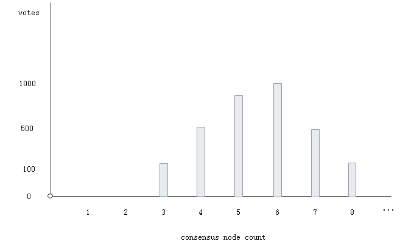
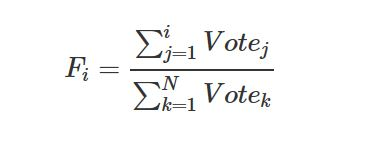
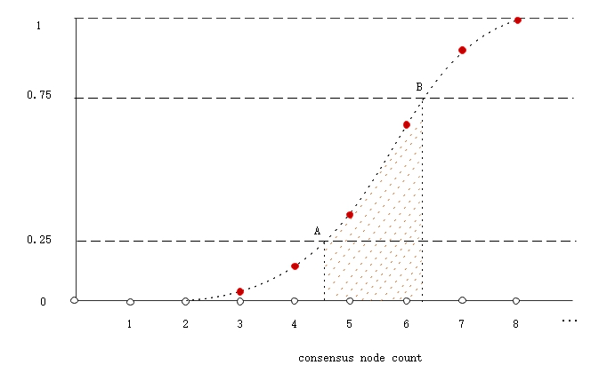

# Voting, Validators, Delegates and Speaker

The PoS model of NEO is embodied in: (1) Anyone can initiate a transaction to apply for being a validator candidate (as long as they are willing to pay for the system fee); (2) Anyone who holds the NEO token can vote to deside which validator candidate can become a consensus node and the number of consensus nodes at anytime. The votes of consensus nodes are calculated by an algorithm described in this chapter. And voting is a dynamic and continuous process. If the NEO asset of a voter is changed (e.g.the NEO is transferred to another address), the number of votes at the previous voting address will also change, and the list of consensus nodes will change accordingly.

At the same time, each block contains `NextConsensus` field, which locks the name list of consensus nodes for next block. That is to say, the current transaction determines the consensus nodes in the next block.

## Voting

In NEO, validator enrollment and voting are through a special transaction `StateTransaction`. When voting for validator candidates, it actually includes two parts: the number of consensus nodes, and name list of consensus nodes.
 There is another transaction can be used for enrollment but deprecated. It is `EnrollmentTransaction`. History data is on the blockchain, but the system does not accept new ones.

### EnrollmentTransaction(Deprecated)

##### **Structure**

| Size | Field | Type  | Description |
|-----|------|------|------|
| 1 | Type | uint8 | transaction type: `0x20` |
| 1 | Version | uint8 | 	transaction version, current is `0` |
| ? | PublicKey | ECPoint |  public key of validator |
| ?\*? | Attributes | tx_attr[]| Additional features that the transaction has |
| 34\*? | Inputs |  tx_in[] | tx input |
| 60\*? | Outputs | tx_out[] | tx output |
| ?\*? | Scripts | script[] | List of scripts used to validate the transaction |

##### **Verification**

1. The system does not accept this transaction any more. The verification result is set to constant value `false`.

2. A validator candidate needs to sign this transaction, as the verification script contains the validator's address.

##### **Process**

1. Register the validator information.

> [!Warning]
>
> Deprecated, replaced by `StateTransanction`, but the transaction processing is reserved to be compatible with history transactins.

### StateTransaction

##### **Structure**

| Size | Field | Type  | Description |
|-----|------|------|------|
| 1 | Type | uint8 | transaction type: `0x90` |
| 1 | Version | uint8 | transaction version, current is `0`  |
| ?\*?   | Descriptors | StateDescriptor[] | voting information  |
| ?\*? | Attributes | tx_attr[]| Additional features that the transaction has |
| 34\*? | Inputs |  tx_in[] |  tx input |
| 60\*? | Outputs | tx_out[] | tx output |
| ?\*? | Scripts | script[] | List of scripts used to validate the transaction |

**StateDescriptor Structure**

| Size | Field | Type  | Description |
|-------|---------|------|-------|
| 1  | Type |  StateType | `0x40`--voting, `0x48`--validator |
| 20/30 |  Key | byte[] |  if `Field = "Votes"`,deposit the script hash the voter; if `Field = "Registered"`, deposit the publicKey of the validator; |
| ? | Field | string |  if `Type = 0x40`, `Field = "Votes"`;  if `Type = 0x48`, `Field = "Registered"`; |
| ? | Value | byte[] | if `Type = 0x40`, deposit the address of the voted validator;   if `Type = 0x48`, deposit boolean value, true -- apply for validator, false -- cancel the application. |

#####  **Verification**

1. Verify `StateDescriptor`：

   1. Check if `StateDescriptor.Type` matches with  `StateDescriptor.Field`.
   
   2. When `StateDescriptor.Type = 0x40`, it means voting:
   
       1. Check if the voter account is an unfrozen account and the amount of NEO is more than zero. 
       
       2. The voted validator address is either in the `StandbyValidators` list or in the list of enrolled candidates.

2. Basic validation of transactions contains: legality and verification scripts. The verification scripts contain the `StateDescriptor.Key`, which requires the signature of the voter or the validator. (Note, when `StateDescriptor.Field = "Votes"`, the `StateDescriptor.Key` field must be converted from public key to script hash.）

#####  **Process**

1. When `StateDescriptor.Type = 0x48`, the `StateDescriptor.Value` is a boolean value. True means to enroll to become a validator. False means to cancel the enrollment.

2. When `StateDescriptor.Type = 0x40`:

    1. If the voter has voted another candidate before, the votes from the voter for the previous candidate will be canceled.

    2. The voted candidate's votes will increase by the amount of NEO asset held by the voter.

    3. If the number of candidates in previous vote is different from current one, the votes to determine the number of consensus nodes will change similarly.

> [!Warning]
>
> When the NEO asset of the voter is changed, the number of votes will be changed accordingly.

## From Candidate to Validator

There are 2 steps in voting for consensus nodes: 

1. calculate the number of consensus nodes;

2. determine the specific consensus nodes.

### The number of consensus nodes

According to the voting described above, we may get a diagram of votes for the number of consensus nodes.

The following formula is to demenstrate the probability distribution funnction F(discrete function), in which the probability of the `i`th consensus node equals its proportion of votes.

On the probability distribution function, take the portion F ∈ [0.25, 0.75] that covers consensus nodes. Then take the expected value for these points. Compare it with the count of backup validators. Take the larger one as the final number of consensus nodes.

- `⌈A⌉` represents the first Fi >= 0.25 point

- `⌈B⌉` represents the first  Fi >= 0.75 point

- min(0.75, Fi) - max( Fi - 1, 0.25 ) is the shadow part

- `StandbyValidators` is standby validators

> [!Note]
>
> We only consider the middle part in the voting diagram, filter out too large or too small points which may have great impact on the average value.

### Consensus Nodes

In the above steps, we calcuate the number of consensus nodes as `Count`, and take validators from the candiate list ranked by votes in descending order. When candidates is not enough, it will be supplemented from `StandbyValidators`. Finally, the consensus nodes are determined.

> [!Note]
>
> Genesis Block is the first block，its `NextConsensus` is set to the script hash of standby consensus nodes' multi-signature contract.

## From Delegate to Speaker

A speaker is a consensus node who creates the next proposal block. The list of consesus nodes is obtained by the method above, and the speaker is determined by the formula `p = (h - v) mod N` in the dBFT algorithm. `h` is the height of the proposal block. `v` is view number, start from 0. `N` is the number of consensus nodes.

During the consensus phase, a speaker will send `PrepareRequest` message with `NextConsensus`, which determines the next block consensus nodes. The Speaker calculates the next round of conosensus nodes by combining the transactions in the proposal block with the previous votes in blockchain, and assign the script hash of 2/3 multi-signature contract to `NextConsensus`. There are transactions that may affect the number of votes. Firstly, there may be a `StateTransaction` to change vote directly. Secondly, there may be a transfer change in voter's NEO assets.
